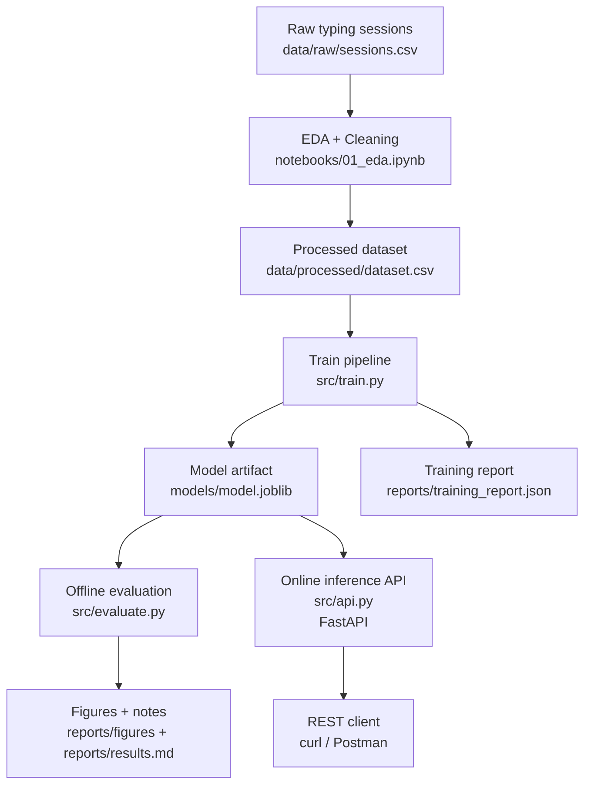
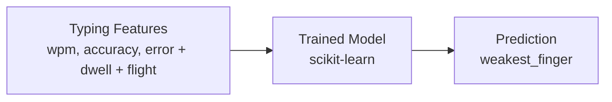

# Typing-ML (Thesis Project)

Beginner-friendly ML workflow for my thesis.

**Phase 1:** Predict `weakest_finger` from typing session summary stats (WPM, accuracy, per-finger error rates, per-finger dwell time, and per-finger flight time).  
**Phase 2:** Use predictions to recommend typing drills that target weak fingers.

---

## Learning Flow (recommended)

This repo is already laid out like a real ML project. Here’s the “mental model” to follow:



If you’re new to ML, treat this as a loop:
- Improve data/feature engineering in EDA → retrain → evaluate → repeat.
- Only after metrics are stable, expose the model via an API.

### Quick Clarification: What `01_eda.ipynb` Does

- `notebooks/01_eda.ipynb` is for **EDA + cleaning + exporting** `data/processed/dataset.csv`.
- It does **not** automatically call `src/train.py`.
- It does **not** automatically call `src/evaluate.py`.
- It does **not** run API prediction serving (that is `src/api.py`).

Recommended sequence:
1. Run `notebooks/01_eda.ipynb`
2. Run `python src/train.py --data data/processed/dataset.csv`
3. Run `python src/evaluate.py --data data/processed/dataset.csv --model models/model.joblib`
4. (Optional) Run `make dev` for prediction API

Validation guardrails in `train.py` and `evaluate.py`:
- Required feature columns must exist and be numeric.
- Feature values must be finite (no `inf`/`-inf`) and within expected ranges.
- Target labels must be one of the 8 finger classes.
- Target must have at least 2 classes and at least 2 rows per class (for stratified split).
---

## Repository Structure

- `notebooks/01_eda.ipynb` — explore/clean data and export processed dataset
- `src/train.py` — reproducible training pipeline
- `src/evaluate.py` — evaluation + plots
- `reports/results.md` — experiment notes (thesis-friendly)

Suggested folders:
- `data/raw/` — raw data (ignored by git)
- `data/processed/` — cleaned data (ignored by git)
- `models/` — saved models (ignored by git)

---

## Setup (Conda)

```bash
conda create -n typing-ml python=3.11 -y
conda activate typing-ml
conda install -y numpy pandas scikit-learn matplotlib seaborn jupyterlab joblib -c conda-forge
```

(Optional) export environment:

```bash
conda env export > environment.yml
```

## Beginner One-Command Flow (Start to Finish)

If you want the fastest way to run the full ML flow end-to-end, use the script below.

Run everything (install deps, generate data, train, evaluate):

```bash
bash scripts/beginner_flow.sh
```

Run a small smoke version (faster):

```bash
bash scripts/beginner_flow.sh --skip-install --users 20 --sessions 5
```

What this script does:
1. Installs dependencies with your Conda environment
2. Generates synthetic dataset
3. Trains model (default: `--model-type auto`)
4. Evaluates and saves confusion matrix

Main outputs you should expect:
- `data/processed/dataset.csv`
- `models/model.joblib`
- `reports/training_report.json`
- `reports/figures/confusion_matrix.png`

Useful options:

```bash
bash scripts/beginner_flow.sh --help
```

`scripts/beginner_flow.sh` validates CLI inputs before running:
- `--users` and `--sessions` must be positive integers.
- `--seed` must be an integer.
- `--model-type` must be `auto`, `logistic_regression`, or `random_forest`.
- Path arguments must be non-empty.

At the end of the flow, it also verifies expected artifacts exist:
- `data/processed/dataset.csv`
- `models/model.joblib`
- `reports/training_report.json`
- `reports/figures/confusion_matrix.png`

Makefile commands in this repo run through Conda by default (`typing-ml` env):

```bash
make install
make dev
make run
make generate-synthetic
make train
make evaluate
make ml-pipeline
make e2e
make refresh-results
make e2e-report
make test-api
make test
```

If your environment name is different:

```bash
make CONDA_ENV=<your-env-name> run
```

Full ML pipeline with overrides (example):

```bash
make CONDA_ENV=typing-ml \
  N_USERS=800 \
  SESSIONS_PER_USER=25 \
  SEED=42 \
  DATA_PATH=data/processed/dataset.csv \
  MODEL_PATH=models/model.joblib \
  REPORT_PATH=reports/training_report.json \
  FIG_DIR=reports/figures \
  ml-pipeline
```

## End-to-End (Standard)

Run one standard end-to-end flow (generate data, train, evaluate):

```bash
make CONDA_ENV=typing-ml e2e
```

Default outputs:
- `data/processed/dataset.csv`
- `models/model.joblib`
- `reports/training_report.json`
- `reports/figures/confusion_matrix.png`

Run with 10,000 rows:

```bash
make CONDA_ENV=typing-ml N_USERS=500 SESSIONS_PER_USER=20 e2e
```

Run a smaller smoke test:

```bash
make CONDA_ENV=typing-ml N_USERS=20 SESSIONS_PER_USER=5 e2e
```

Generate or refresh the filled thesis results markdown from latest artifacts:

```bash
make CONDA_ENV=typing-ml refresh-results
```

Run full pipeline and refresh filled results in one command:

```bash
make CONDA_ENV=typing-ml e2e-report
```

---

## Methodology (Thesis Summary)

This project applies a **quantitative experimental methodology** using **supervised multiclass classification** to predict the `weakest_finger` from typing-session behavior.

### 1. Research Design

- Approach: quantitative, experimental, model-building.
- Objective: classify the weakest finger based on typing dynamics.

### 2. Problem Formulation

- Task type: multiclass classification.
- Target variable: `weakest_finger` (8 classes).

### 3. Feature Set

The model uses:

- Global features: `wpm`, `accuracy`
- Per-finger error features: `error_<finger>`
- Per-finger dwell-time features: `dwell_<finger>`
- Per-finger flight-time features: `flight_<finger>`

This reflects the thesis-valid feature set (including dwell time and flight time).

### 4. Data Preparation

- Validate required columns and numeric ranges.
- Reject non-finite feature values (`inf`, `-inf`).
- Validate target labels and minimum per-class sample counts for stratified split.
- Split dataset into train and test with stratification.
- Use a fixed random seed for reproducibility.

### 5. Modeling Strategy

- Candidate models: Logistic Regression and Random Forest.
- `--model-type auto` trains candidates and selects the best by holdout accuracy.

### 6. Evaluation

- Accuracy
- Precision, Recall, F1-score per class
- Confusion Matrix

The confusion matrix is used to inspect class-level errors between finger labels.

### 7. Reproducibility and Artifacts

The pipeline is fully scriptable (`make e2e`) and produces:

- `data/processed/dataset.csv`
- `models/model.joblib`
- `reports/training_report.json`
- `reports/figures/confusion_matrix.png`

## ML Research Details (Thesis-Oriented)

This section summarizes the machine learning research choices in a way that can be reused in a thesis chapter.

### 1. Research Objective

The objective is to model and predict a typist's weakest finger from keystroke-derived behavioral features so that practice recommendations can be targeted to specific motor weaknesses.

### 2. ML Task Definition

- Learning type: supervised learning
- Task type: multiclass classification
- Target class: `weakest_finger` (8 labels)
- Input structure: tabular numeric features per typing session

### 3. Input Feature Groups

The final feature set is intentionally aligned with typing biomechanics:

- Performance-level features: `wpm`, `accuracy`
- Error behavior: `error_<finger>`
- Key hold behavior: `dwell_<finger>`
- Inter-key transition behavior: `flight_<finger>`

This means the standard model already includes dwell time and flight time as first-class features.

### 4. Models Used in This Project

Training in this repository evaluates two model families:

1. Logistic Regression
2. Random Forest

Selection behavior:

- `--model-type auto` trains both candidates and selects the one with the best holdout accuracy.
- `--model-type logistic_regression` forces Logistic Regression.
- `--model-type random_forest` forces Random Forest.

Why these models:

- Logistic Regression provides a strong linear baseline that is easy to interpret.
- Random Forest captures non-linear interactions between per-finger error/dwell/flight patterns.

### 5. Experimental Protocol

- Data split: stratified train-test split (`test_size=0.2`) to preserve class proportions.
- Random control: fixed `random_state` for reproducibility.
- Pipeline strategy: preprocessing + model packaged into a single sklearn pipeline.
- Artifact persistence: model + metadata saved with `joblib`.

### 6. Evaluation Metrics and Interpretation

The project reports:

- Accuracy
- Precision per class
- Recall per class
- F1-score per class
- Confusion Matrix

Metric formula used for top-level performance:

$$
  	ext{Accuracy} = \frac{\text{Correct Predictions}}{\text{Total Predictions}}
$$

The confusion matrix is the key diagnostic for checking which finger classes are most often confused.

### 7. Model Output Artifacts

Standard end-to-end run (`make e2e`) produces:

- `data/processed/dataset.csv`
- `models/model.joblib`
- `reports/training_report.json`
- `reports/figures/confusion_matrix.png`

### 8. Validity Notes and Current Limitations

- Synthetic data may not fully represent real-world typing variability.
- Holdout-based selection is useful for practical comparison but should be complemented with cross-validation for final reporting.
- Class balance and class difficulty should be discussed using per-class recall/F1, not accuracy alone.
- External validity is strongest when evaluation is repeated on real session data collected from target users.

### 9. Recommended Thesis Reporting Structure

For a clear thesis narrative, present results in this order:

1. Dataset and feature schema
2. Experimental setup and split strategy
3. Candidate model comparison
4. Final model selection rationale
5. Metric table (accuracy, macro avg, weighted avg)
6. Confusion matrix analysis
7. Limitations and future improvements

### 10. Results Template (Ready to Fill)

Use the template below after each experiment run.
For a standalone copy you can edit per experiment, use `reports/results_template.md`.
For the latest filled example generated from an actual run, see `reports/results_filled_latest.md`.

#### A. Experiment Setup Table

| Field | Value |
|---|---|
| Dataset path | `data/processed/dataset.csv` |
| Number of rows | `<fill>` |
| Random seed | `42` |
| Train-test split | `80:20 (stratified)` |
| Candidate models | `logistic_regression`, `random_forest` |
| Selected model | `<fill from training_report.json>` |

#### B. Performance Summary Table

| Metric | Value |
|---|---|
| Accuracy | `<fill>` |
| Macro Precision | `<fill>` |
| Macro Recall | `<fill>` |
| Macro F1-score | `<fill>` |
| Weighted F1-score | `<fill>` |

#### C. Per-Class Example Table

| Class | Precision | Recall | F1-score | Support |
|---|---:|---:|---:|---:|
| left_pinky | `<fill>` | `<fill>` | `<fill>` | `<fill>` |
| left_ring | `<fill>` | `<fill>` | `<fill>` | `<fill>` |
| left_middle | `<fill>` | `<fill>` | `<fill>` | `<fill>` |
| left_index | `<fill>` | `<fill>` | `<fill>` | `<fill>` |
| right_index | `<fill>` | `<fill>` | `<fill>` | `<fill>` |
| right_middle | `<fill>` | `<fill>` | `<fill>` | `<fill>` |
| right_ring | `<fill>` | `<fill>` | `<fill>` | `<fill>` |
| right_pinky | `<fill>` | `<fill>` | `<fill>` | `<fill>` |

#### D. English Narrative Starters

1. "The selected model for this experiment was `<model_name>`, chosen based on the highest holdout accuracy."
2. "The model achieved an overall accuracy of `<value>` on the test set."
3. "Class-wise analysis shows that `<best_class>` has the highest recall, while `<hard_class>` remains the most challenging class."
4. "The confusion matrix indicates that misclassification mainly occurs between `<class_a>` and `<class_b>`."
5. "These results suggest that dwell-time and flight-time features contribute meaningful signal for weakest-finger classification."

#### E. Bahasa Indonesia Narrative Starters

1. "Model terpilih pada eksperimen ini adalah `<model_name>`, berdasarkan akurasi holdout tertinggi."
2. "Model menghasilkan akurasi keseluruhan sebesar `<value>` pada data uji."
3. "Analisis per kelas menunjukkan bahwa `<kelas_terbaik>` memiliki recall tertinggi, sedangkan `<kelas_sulit>` masih menjadi kelas yang paling menantang."
4. "Confusion matrix menunjukkan bahwa kesalahan klasifikasi paling sering terjadi antara `<kelas_a>` dan `<kelas_b>`."
5. "Hasil ini mengindikasikan bahwa fitur dwell time dan flight time memberikan sinyal yang bermakna untuk klasifikasi jari terlemah."

#### F. Figure Caption Template

"Figure X. Confusion Matrix of weakest-finger classification using `<model_name>` on the test set (seed=`42`, split=`80:20 stratified`)."

### Metodologi (Ringkasan Bahasa Indonesia)

Penelitian ini menggunakan pendekatan **kuantitatif eksperimental** dengan tugas **klasifikasi multikelas terawasi (supervised multiclass classification)** untuk memprediksi `weakest_finger` dari perilaku sesi mengetik.

1. Desain penelitian:
- Pendekatan kuantitatif berbasis pemodelan machine learning.
- Tujuan utama adalah mengklasifikasikan jari terlemah dari fitur dinamika pengetikan.

2. Perumusan masalah:
- Jenis tugas: klasifikasi multikelas (8 kelas jari).
- Variabel target: `weakest_finger`.

3. Fitur yang digunakan:
- Fitur global: `wpm`, `accuracy`.
- Fitur error per jari: `error_<finger>`.
- Fitur dwell time per jari: `dwell_<finger>`.
- Fitur flight time per jari: `flight_<finger>`.

4. Persiapan data:
- Validasi kolom wajib dan rentang nilai.
- Pembagian data latih-uji secara stratified.
- Penggunaan random seed tetap untuk reprodusibilitas.

5. Strategi pemodelan:
- Model kandidat: Logistic Regression dan Random Forest.
- Opsi `--model-type auto` memilih model terbaik berdasarkan akurasi holdout.

6. Evaluasi:
- Accuracy.
- Precision, Recall, dan F1-score per kelas.
- Confusion Matrix untuk analisis kesalahan antar kelas.

7. Reprodusibilitas:
- Pipeline dapat dijalankan end-to-end dengan `make e2e`.
- Artefak utama yang dihasilkan: dataset, model, laporan pelatihan, dan confusion matrix.

---

## Frameworks / Libraries Used (and Why)

If you are new to ML, this is the most important stack in this repo:

- **scikit-learn** (main ML framework)
  - Used to build the training pipeline in `src/train.py`
  - Components used: `Pipeline`, `StandardScaler`, `LogisticRegression`, `train_test_split`, `classification_report`
  - Purpose: train a classifier that predicts `weakest_finger` from typing features

- **pandas**
  - Used in `src/train.py`, `src/evaluate.py`, and `src/api.py`
  - Purpose: load CSV data and prepare tabular features for model training/inference

- **joblib**
  - Used in `src/train.py` and `src/api.py`
  - Purpose: save and load the trained model artifact (`models/model.joblib`)

- **matplotlib** (and optionally seaborn for EDA)
  - Used in `src/evaluate.py` and notebook EDA
  - Purpose: visualize results (for example confusion matrix plots)

- **FastAPI** (+ **Pydantic**, served with **Uvicorn**)
  - Used in `src/api.py`
  - Purpose: expose the trained model as a REST API (`/predict`, `/predict_batch`, `/metadata`)

Short answer: the ML framework here is **scikit-learn**, while the others support data handling, visualization, model persistence, and deployment.

### Quick ML Terms (Beginner)

- **Feature**
  - Input value used by the model (example: `wpm`, `accuracy`, finger error rates).

- **Target / Label**
  - What the model tries to predict.
  - In this project: `weakest_finger`.

- **Classifier**
  - A model that predicts a category/class.
  - Here, it predicts which finger is the weakest.

- **Training**
  - The process where the model learns patterns from historical data.

- **Inference (Prediction)**
  - Using the trained model on new input data to get predictions.
  - In this repo, inference is available through the API endpoints.

- **Evaluation**
  - Checking model quality with metrics and plots (for example classification report and confusion matrix).

### End-to-End Example (1 Input → 1 Prediction)

1. You send one typing summary row to the API (`/predict`), for example:
  - `wpm`: 55
  - `accuracy`: 0.93
  - per-finger error, dwell-time, and flight-time features
2. The API loads your trained model (`models/model.joblib`) and runs inference.
3. The API returns a class label prediction, for example:
  - `prediction: "right_pinky"`
4. Optional probabilities can also be returned if supported by the model.

This is the full ML loop in production form: **input features → model → predicted weakest finger**.



Where each step lives: input data in `data/processed/dataset.csv`, trained artifact in `models/model.joblib`, and inference endpoints in `src/api.py`.

---

## Data

Expected file:

- `data/raw/sessions.csv`

Minimum columns:
- `user_id`, `session_id`, `timestamp`
- `wpm`, `accuracy`
- `error_left_pinky`, `error_left_ring`, `error_left_middle`, `error_left_index`, `error_right_index`, `error_right_middle`, `error_right_ring`, `error_right_pinky`
- `dwell_left_pinky`, `dwell_left_ring`, `dwell_left_middle`, `dwell_left_index`, `dwell_right_index`, `dwell_right_middle`, `dwell_right_ring`, `dwell_right_pinky`
- `flight_left_pinky`, `flight_left_ring`, `flight_left_middle`, `flight_left_index`, `flight_right_index`, `flight_right_middle`, `flight_right_ring`, `flight_right_pinky`
- `weakest_finger` (target label)

> Note: `data/raw/` and `data/processed/` are usually ignored by git to avoid committing large/private datasets.

---

## Synthetic Data

The generator includes per-finger error, dwell, and flight features, with mild per-user learning trends.

```bash
python src/generate_synthetic_data.py
```

Default output:
- `data/processed/dataset.csv`

Custom output and size:

```bash
python src/generate_synthetic_data.py \
  --n-users 800 \
  --sessions-per-user 25 \
  --seed 42 \
  --output data/processed/dataset_custom.csv
```

---

## Run EDA

Start JupyterLab:

```bash
conda activate typing-ml
jupyter lab
```

Open:
- `notebooks/01_eda.ipynb`

Run all cells to generate:
- `data/processed/dataset.csv`

---

## Train

```bash
python src/train.py --data data/processed/dataset.csv
```

Choose model strategy:

```bash
python src/train.py --data data/processed/dataset.csv --model-type auto
# or: --model-type logistic_regression
# or: --model-type random_forest
```

---

## Evaluate

```bash
python src/evaluate.py --data data/processed/dataset.csv --model models/model.joblib
```

Outputs:
- metrics in terminal
- confusion matrix plot in `reports/figures/` (if enabled)

---

## Serve Model (REST API)

If you want to test your model through a REST endpoint (Postman/curl), use FastAPI.

Install (conda-forge):

```bash
make install
```

Run the API:

```bash
make dev
# or: make run
```

Docs:
- API guide: [docs/api.md](docs/api.md)
- Interactive Swagger UI: http://127.0.0.1:8000/docs

Test:

```bash
curl -s http://127.0.0.1:8000/metadata | python -m json.tool
```

Predict (single row):

```bash
curl -s http://127.0.0.1:8000/predict \
	-H 'Content-Type: application/json' \
  -d '{"row": {"wpm": 55, "accuracy": 0.93, "error_left_pinky": 0.02, "error_left_ring": 0.01, "error_left_middle": 0.01, "error_left_index": 0.01, "error_right_index": 0.02, "error_right_middle": 0.01, "error_right_ring": 0.01, "error_right_pinky": 0.01, "dwell_left_pinky": 115, "dwell_left_ring": 98, "dwell_left_middle": 91, "dwell_left_index": 86, "dwell_right_index": 88, "dwell_right_middle": 93, "dwell_right_ring": 99, "dwell_right_pinky": 121, "flight_left_pinky": 220, "flight_left_ring": 198, "flight_left_middle": 180, "flight_left_index": 171, "flight_right_index": 174, "flight_right_middle": 182, "flight_right_ring": 203, "flight_right_pinky": 231}}' \
	| python -m json.tool
```

---

## Notes

- If you want plots visible on GitHub, commit `notebooks/01_eda.ipynb` **with outputs**.
- Notebooks appear as “modified” after running because outputs are stored inside `.ipynb`.
---

