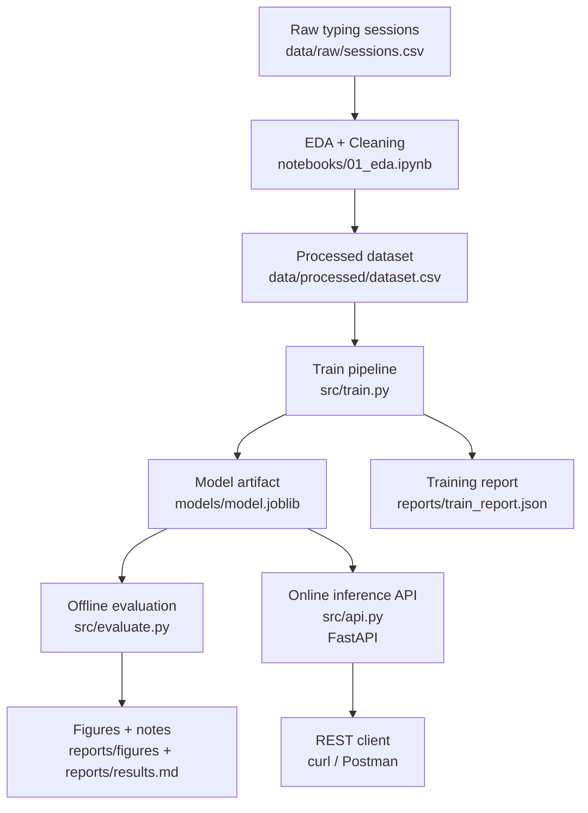
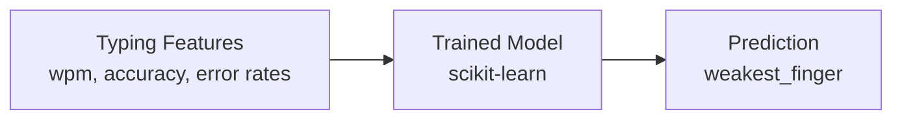

# Typing-ML (Thesis Project)

Beginner-friendly ML workflow for my thesis.

**Phase 1:** Predict `weakest_finger` from typing session summary stats (WPM, accuracy, per-finger error rates).  
**Phase 2:** Use predictions to recommend typing drills that target weak fingers.

---

## Learning Flow (recommended)

This repo is already laid out like a real ML project. Here’s the “mental model” to follow:



If you’re new to ML, treat this as a loop:
- Improve data/feature engineering in EDA → retrain → evaluate → repeat.
- Only after metrics are stable, expose the model via an API.

### Quick Clarification: What `01_eda.ipynb` Does

- `notebooks/01_eda.ipynb` is for **EDA + cleaning + exporting** `data/processed/dataset.csv`.
- It does **not** automatically call `src/train.py`.
- It does **not** automatically call `src/evaluate.py`.
- It does **not** run API prediction serving (that is `src/api.py`).

Recommended sequence:
1. Run `notebooks/01_eda.ipynb`
2. Run `python src/train.py --data data/processed/dataset.csv`
3. Run `python src/evaluate.py --data data/processed/dataset.csv --model models/model.joblib`
4. (Optional) Run `uvicorn src.api:app --reload --port 8000` for prediction API
---

## Repository Structure

- `notebooks/01_eda.ipynb` — explore/clean data and export processed dataset
- `src/train.py` — reproducible training pipeline
- `src/evaluate.py` — evaluation + plots
- `reports/results.md` — experiment notes (thesis-friendly)

Suggested folders:
- `data/raw/` — raw data (ignored by git)
- `data/processed/` — cleaned data (ignored by git)
- `models/` — saved models (ignored by git)

---

## Setup (Conda)

```bash
conda create -n typing-ml python=3.11 -y
conda activate typing-ml
conda install -y numpy pandas scikit-learn matplotlib seaborn jupyterlab joblib -c conda-forge
```

(Optional) export environment:

```bash
conda env export > environment.yml
```

---

## Frameworks / Libraries Used (and Why)

If you are new to ML, this is the most important stack in this repo:

- **scikit-learn** (main ML framework)
  - Used to build the training pipeline in `src/train.py`
  - Components used: `Pipeline`, `StandardScaler`, `LogisticRegression`, `train_test_split`, `classification_report`
  - Purpose: train a classifier that predicts `weakest_finger` from typing features

- **pandas**
  - Used in `src/train.py`, `src/evaluate.py`, and `src/api.py`
  - Purpose: load CSV data and prepare tabular features for model training/inference

- **joblib**
  - Used in `src/train.py` and `src/api.py`
  - Purpose: save and load the trained model artifact (`models/model.joblib`)

- **matplotlib** (and optionally seaborn for EDA)
  - Used in `src/evaluate.py` and notebook EDA
  - Purpose: visualize results (for example confusion matrix plots)

- **FastAPI** (+ **Pydantic**, served with **Uvicorn**)
  - Used in `src/api.py`
  - Purpose: expose the trained model as a REST API (`/predict`, `/predict_batch`, `/metadata`)

Short answer: the ML framework here is **scikit-learn**, while the others support data handling, visualization, model persistence, and deployment.

### Quick ML Terms (Beginner)

- **Feature**
  - Input value used by the model (example: `wpm`, `accuracy`, finger error rates).

- **Target / Label**
  - What the model tries to predict.
  - In this project: `weakest_finger`.

- **Classifier**
  - A model that predicts a category/class.
  - Here, it predicts which finger is the weakest.

- **Training**
  - The process where the model learns patterns from historical data.

- **Inference (Prediction)**
  - Using the trained model on new input data to get predictions.
  - In this repo, inference is available through the API endpoints.

- **Evaluation**
  - Checking model quality with metrics and plots (for example classification report and confusion matrix).

### End-to-End Example (1 Input → 1 Prediction)

1. You send one typing summary row to the API (`/predict`), for example:
  - `wpm`: 55
  - `accuracy`: 0.93
  - finger error-rate features
2. The API loads your trained model (`models/model.joblib`) and runs inference.
3. The API returns a class label prediction, for example:
  - `prediction: "right_pinky"`
4. Optional probabilities can also be returned if supported by the model.

This is the full ML loop in production form: **input features → model → predicted weakest finger**.



Where each step lives: input data in `data/processed/dataset.csv`, trained artifact in `models/model.joblib`, and inference endpoints in `src/api.py`.

---

## Data

Expected file:

- `data/raw/sessions.csv`

Minimum columns:
- `user_id`, `session_id`, `timestamp`
- `wpm`, `accuracy`
- `error_left_pinky`, `error_left_ring`, `error_left_middle`, `error_left_index`
- `error_right_index`, `error_right_middle`, `error_right_ring`, `error_right_pinky`
- `weakest_finger` (target label)

> Note: `data/raw/` and `data/processed/` are usually ignored by git to avoid committing large/private datasets.

---

## Generate Synthetic Data (optional)

If you don’t have real data yet, you can generate a small synthetic dataset to test the pipeline.

```bash
mkdir -p data/raw
python src/generate_synthetic_data.py
```

This will create:
- `data/raw/sessions.csv`

---

## Run EDA

Start JupyterLab:

```bash
conda activate typing-ml
jupyter lab
```

Open:
- `notebooks/01_eda.ipynb`

Run all cells to generate:
- `data/processed/dataset.csv`

---

## Train

```bash
python src/train.py --data data/processed/dataset.csv
```

---

## Evaluate

```bash
python src/evaluate.py --data data/processed/dataset.csv --model models/model.joblib
```

Outputs:
- metrics in terminal
- confusion matrix plot in `reports/figures/` (if enabled)

---

## Serve Model (REST API)

If you want to test your model through a REST endpoint (Postman/curl), use FastAPI.

Install (conda-forge):

```bash
conda activate typing-ml
conda install -y fastapi uvicorn -c conda-forge
```

Run the API:

```bash
uvicorn src.api:app --reload --port 8000
```

Docs:
- API guide: [docs/api.md](docs/api.md)
- Interactive Swagger UI: http://127.0.0.1:8000/docs

Test:

```bash
curl -s http://127.0.0.1:8000/metadata | python -m json.tool
```

Predict (single row):

```bash
curl -s http://127.0.0.1:8000/predict \
	-H 'Content-Type: application/json' \
	-d '{"features": {"wpm": 55, "accuracy": 0.93, "error_left_pinky": 0.02, "error_left_ring": 0.01, "error_left_middle": 0.01, "error_left_index": 0.01, "error_right_index": 0.02, "error_right_middle": 0.01, "error_right_ring": 0.01, "error_right_pinky": 0.01}}' \
	| python -m json.tool
```

---

## Notes

- If you want plots visible on GitHub, commit `notebooks/01_eda.ipynb` **with outputs**.
- Notebooks appear as “modified” after running because outputs are stored inside `.ipynb`.
---

